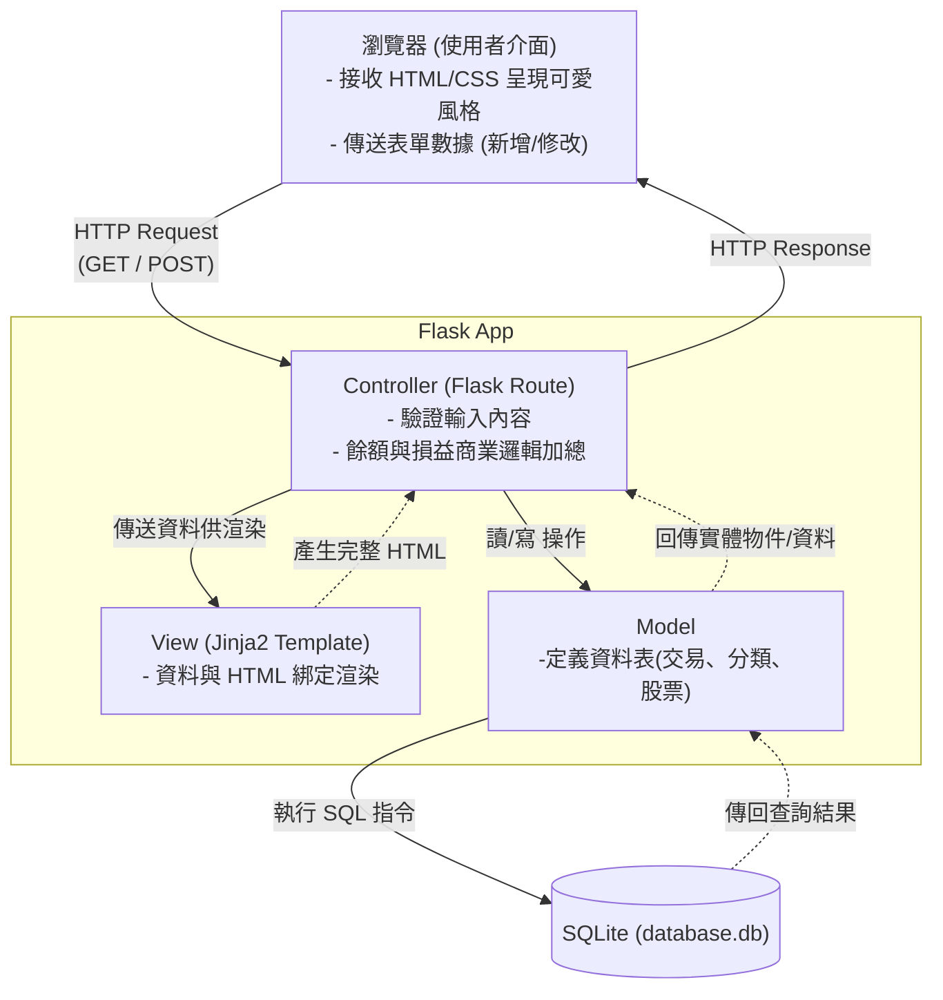

# 系統架構設計文件 (Architecture Document)

根據 PRD 需求，本文件定義了「個人記帳簿」專案的系統技術架構、資料夾結構分配與各個系統元件之職責。

## 1. 技術架構說明

本專案採用輕量級的三層式 Web 架構，主要技術棧如下：

- **選用技術與原因**：
  - **後端：Python + Flask**  
    Flask 為輕量且極具彈性的微框架，十分適合個人專案及中小型應用，有助於快速建構與迭代。
  - **模板引擎：Jinja2**  
    因專案不採用前後端分離，網頁將直接由 Flask 結合 Jinja2 在伺服器端渲染 HTML 提供給瀏覽器，這有效省去了建立複雜前端框架的成本，亦更容易維護。
  - **資料庫：SQLite**  
    個人記帳輔助工具負載不大且不需要多人高並發存取。SQLite 作為內建於檔案系統中的資料庫引擎，無須配置獨立資料庫伺服器，對本專案是最完美且輕量的選擇。

- **Flask MVC 模式說明**：
  儘管 Flask 沒有強制規範，但專案將會依據概念將程式分為 Model/View/Controller 三個層面：
  - **Model（模型）**：負責定義資料庫結構，例如「收支紀錄 (Transaction)」與「股票紀錄 (Stock)」，並執行庫存寫入、更動和刪除。
  - **View（視圖）**：即 `templates` 內的 HTML，主要接收從後端傳來的資料，依照「圓潤、可愛」風格套用標籤與樣式，呈現給用戶。
  - **Controller（控制器）**：由 Flask 的路由 (Route) 負責，處理用戶端傳來的請求（如表單送出），執行運算邏輯（計算餘額／盈虧），並要求 `Model` 進行寫入後，通知 `View` 渲染最新資料。

## 2. 專案資料夾結構

保持資料夾乾淨與職責單一化是此專案建構初期的重點：

```text
web_app_development/
├── app/                  ← [主應用程式目錄]
│   ├── __init__.py       ← Flask 初始化設定與套件整合（如資料庫連線初始化）
│   ├── models/           ← 資料庫模型定義（例如 transaction.py, stock.py）
│   ├── routes/           ← 負責不同頁面與 API 的路由（例如 main.py, expense.py）
│   ├── templates/        ← Jinja2 HTML 檔案（包含 base.html 以及呈現各頁面的網頁）
│   └── static/           ← 靜態資源檔案
│       ├── css/          ← 定義圓潤可愛風格、色系變數與微動畫的 CSS 檔
│       ├── js/           ← 清單輔助邏輯、表單驗證等輕量級腳本
│       └── img/          ← Icon、插圖等視覺資源
├── instance/             ← [實例目錄]
│   └── database.db       ← 系統自動建立或存放的 SQLite 檔案 (需被 gitignore 忽略)
├── docs/                 ← [專案文件]
│   ├── PRD.md            ← 產品需求文件
│   └── ARCHITECTURE.md   ← 本架構文件
├── .agents/              ← [輔助工具] Skill 等內部腳本定義
├── app.py                ← 專案啟動入口，負責執行開發伺服器
└── requirements.txt      ← Python 依賴套件表 (如 Flask, SQLAlchemy 等)
```

## 3. 元件關係圖

以下呈現使用者從操作介面到系統後台的資料流向關係：



## 4. 關鍵設計決策

1. **Monolithic 單體式結合 SSR 渲染**：  
   **決策原因**：不拆分前後端能以最小開發成本達成 MVP 範圍內的所有功能。資料由 Flask 生成網頁時一併注入 Jinja2 中，避免了額外定義與抓取 API 的過程。

2. **「收支」與「股票」資料表各自獨立**：  
   **決策原因**：一般記帳與股票買賣屬於兩套截然不同的運作與計算邏輯（例如股票需考量買入價、現價、股數等），強行放入同一張表會使結構紊亂。在資料庫端獨立為不同的表，僅在 Controller 面向介面時再將數據整合成最終餘額，達到高內聚低耦合的標準。

3. **統一管理的 CSS 主題資源 (Theme)**：  
   **決策原因**：PRD 要求「圓潤可愛」和「輕鬆愉悅」。為了實踐此體驗，會在 `static/css/` 配置一套專屬的主題基礎檔（例如包含主色、輔助色、預設的 border-radius 半徑），所有的 Jinja 模板透過繼承 `base.html` 來確保整體應用外觀具有高度一致性。

4. **採用 SQLAlchemy 等 ORM 取代原生 SQL（建議）**：  
   **決策原因**：將使用 ORM（物件關聯對映）來處理與 SQLite 的溝通。除了避免常見的 SQL Injection 資安風險外，以 Python Class 的形式呈現資料結構（如 `User`, `Transaction`), 開發時易讀性較佳，且後續想修改或擴充資料庫欄位也較為便利。
