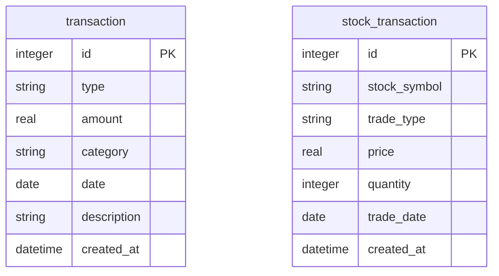

# 資料庫設計文件 (DB Design)

本文件描述「個人記帳簿」系統所使用的 SQLite 資料庫設計，包含實體關係圖、資料表詳細說明以及相關配置。

## 1. ER 圖（實體關係圖）

目前的 MVP 範圍將「日常收支」與「股票買賣紀錄」分流至不同的資料表管理。此設計避免了共用結構導致的欄位浪費與邏輯混雜。

## 2. 資料表詳細說明

### 2.1 `transaction` (收支紀錄表)

用來儲存使用者的所有日常收入與支出紀錄，並可用於計算總餘額。

| 欄位名稱 | 型別 | 必填 | 說明 |
| :--- | :--- | :--- | :--- |
| `id` | INTEGER | 是 | Primary Key，自動遞增。 |
| `type` | VARCHAR(50) | 是 | 紀錄類型，可為 `income` (收入) 或 `expense` (支出)。 |
| `amount` | REAL | 是 | 總金額。 |
| `category` | VARCHAR(100) | 是 | 開銷或收入分類 (例如：飲食、交通、薪水)。 |
| `date` | DATE | 是 | 該筆收支發生的日期。 |
| `description` | TEXT | 否 | 其他備註。 |
| `created_at` | DATETIME| 否 | 系統自動產生之時間戳記。 |

### 2.2 `stock_transaction` (股票紀錄表)

用來儲存使用者的股票買賣交易紀錄，結合時價可用於計算未實現或已實現損益。

| 欄位名稱 | 型別 | 必填 | 說明 |
| :--- | :--- | :--- | :--- |
| `id` | INTEGER | 是 | Primary Key，自動遞增。 |
| `stock_symbol` | VARCHAR(20) | 是 | 股票代號 (例如：2330.TW)。 |
| `trade_type` | VARCHAR(50) | 是 | 交易類型，可為 `buy` (買入) 或 `sell` (賣出)。 |
| `price` | REAL | 是 | 買賣時之單價。 |
| `quantity` | INTEGER | 是 | 交易之股數。 |
| `trade_date` | DATE | 是 | 真實交易發生的日期。 |
| `created_at` | DATETIME| 否 | 系統自動產生之時間戳記。 |

## 3. SQL 建表語法

建表語法可見於 `database/schema.sql`，開發上也可不使用該檔案，直接透過 SQLAlchemy 的 `db.create_all()` 產生。

## 4. Python Model 程式碼

系統採用 `Flask-SQLAlchemy`，實體類別實作於：
- `app/database.py`: 定義共用的 `db` 實例
- `app/models/transaction.py`: 包含 Transaction 模型與 CRUD
- `app/models/stock.py`: 包含 StockTransaction 模型與 CRUD
