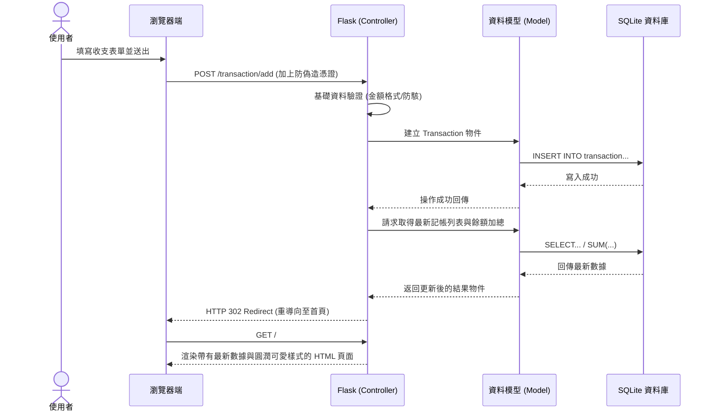

# 流程圖與功能對照設計 (Flowchart)

根據產品需求文件 (PRD) 與架構設計 (ARCHITECTURE)，本文件視覺化了「個人記帳簿」的使用者操作路徑、系統內部資料流，以及對應的功能接口。

## 1. 使用者流程圖（User Flow）

此流程圖呈現使用者進入應用程式後，能執行的各主要操作路徑。包含新增日常收支、股票紀錄，以及後續的校正（編輯、刪除）流程。

```mermaid
flowchart LR
    A([使用者進入網站]) --> B[首頁 - 餘額總攬與紀錄列表]
    
    B --> C{選擇欲執行的操作}
    
    C -->|新增收支| D[填寫收支表單 (金額/種類)]
    C -->|新增股票紀錄| E[填寫股票表單 (買賣價/股數)]
    C -->|編輯特定紀錄| F[修改收支或股票表單]
    C -->|刪除特定紀錄| G[彈出確認刪除視窗]
    
    D --> H([儲存並重新計算餘額])
    E --> I([儲存並重新計算損益])
    F --> J([更新資料庫])
    G --> K([自資料庫移除])
    
    H --> B
    I --> B
    J --> B
    K --> B
```

## 2. 系統序列圖（Sequence Diagram）

此序列圖描述了「使用者送出新增收支表單」到「頁面重新顯示最新餘額」這段時間內，系統前後端及實體資料庫之間的互動流程。



## 3. 功能清單與 API 對照表

以下為本專案提供之操作行為對應的 URL 設計與 HTTP 方法：

| 功能名稱 | URL 路徑 | HTTP 方法 | 說明 |
| :--- | :--- | :--- | :--- |
| **首頁總覽** | `/` | GET | 呈現可用餘額、分類列表與所有的收支/股票紀錄。 |
| **新增收支** | `/transaction/add` | POST | 接收收支表單資料並儲存至資料庫。 |
| **編輯收支** | `/transaction/edit/<id>` | POST | 修改指定 ID 之收支紀錄內容，以便進行帳務校正。 |
| **刪除收支** | `/transaction/delete/<id>` | POST | 刪除指定 ID 之收支紀錄。 |
| **新增股票** | `/stock/add` | POST | 接收股票表單資料並儲存至資料庫，用以計算損益。 |
| **編輯股票** | `/stock/edit/<id>` | POST | 修改指定 ID 之股票紀錄內容。 |
| **刪除股票** | `/stock/delete/<id>` | POST | 刪除指定 ID 之股票紀錄。 |
